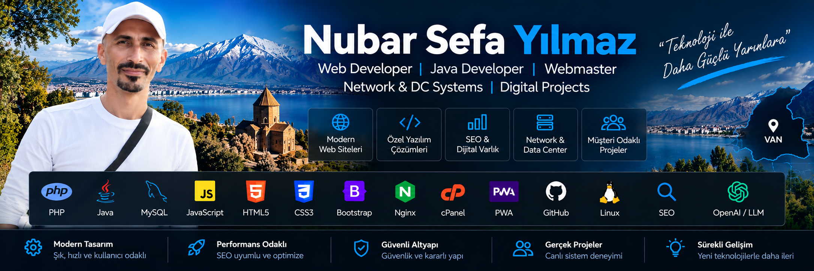

# Nubar Sefa Yılmaz

### Web Developer • Java Developer • Webmaster • Network & DC Systems • Digital Projects

Web geliştirme, yazılım, sistem ve dijital projeler üzerinde çalışan çok disiplinli bir teknik profesyonelim. Kurumsal web sitelerinden özel yönetim panellerine, üyelik sistemlerinden SEO ve AI/LLM keşfedilebilirlik çalışmalarına kadar uçtan uca dijital çözümler geliştiriyorum.

## 🧰 Teknoloji & Uzmanlık

## Uzmanlık Alanlarım

- Web geliştirme ve webmaster çalışmaları
- PHP / MySQL tabanlı özel web uygulamaları
- Java geliştirme
- HTML5, CSS3 ve JavaScript
- Responsive / mobil uyumlu arayüzler
- Admin ve kullanıcı panelleri
- Teknik SEO ve Schema.org
- AI / LLM keşfedilebilirlik optimizasyonları
- PWA ve web performans optimizasyonu
- Network ve DC sistemleri
- Grafik tasarım ve video düzenleme

## 🚀 Öne Çıkan Projeler

### 🌱 [ŞeffafPazar](https://github.com/bensefa/seffafpazar)
**Canlı:** https://seffafpazar.com/

Türkiye'deki üreticiler ile alıcıları buluşturan dijital pazar platformu. Üretici/alıcı üyelik sistemi, özel yönetim panelleri, ürün onay süreçleri, mesajlaşma, üretici doğrulama, Türkiye haritası, PWA, SEO, Schema ve AI/LLM keşfedilebilirlik altyapısı.

### ✒️ [VanKaligrafi](https://github.com/bensefa/vankaligrafi)
**Canlı:** https://vankaligrafi.com/

Kaligrafi çalışma sayfaları, çoklu font sistemi, canlı önizleme, üyelik, kullanıcı hesabı ve özel admin paneli içeren web uygulaması.

### 📣 [Van Reklam](https://github.com/bensefa/vanreklam)
**Canlı:** https://vanreklam.com/

Kurumsal web tasarım, reklam ve dijital hizmetler sitesi. Responsive tasarım, yönetilebilir içerik alanları, teknik SEO, Schema ve AI/LLM optimizasyonları.

### 🧼 [Van Dilek Halı Yıkama](https://github.com/bensefa/vandilekhaliyikama)
**Canlı:** https://vandilekhaliyikama.com/

Yerel hizmet sektörü için performans, teknik SEO, Schema.org ve AI/LLM keşfedilebilirliği odaklı kurumsal web projesi.

### 🧽 [Van Halı Yıkama](https://github.com/bensefa/vanhaliyikama)
**Canlı:** https://vanhaliyikama.tr/

Video tabanlı içerik sunumu, responsive arayüz, yönetilebilir içerik ve yerel SEO altyapısı bulunan kurumsal web sitesi.

### 🎬 [Başaran Halı Yıkama](https://github.com/bensefa/basaranhaliyikama)
**Canlı:** https://basaranhaliyikama.tr/

Çoklu dikey video sunumu, mobil optimizasyon, performans, teknik SEO ve reklam uyumluluğu üzerine geliştirilen web projesi.

### 🪑 [ADN Mobilya](https://github.com/bensefa/adnmobilya)
**Canlı:** https://adnmobilya.com/

Mobilya sektörü için marka ve ürün sunumuna odaklanan responsive kurumsal web tasarım projesi.

## 💻 Teknolojiler

`PHP` · `MySQL` · `Java` · `HTML5` · `CSS3` · `JavaScript` · `Responsive Design` · `PWA` · `Technical SEO` · `Schema.org` · `AI/LLM Optimization`

## 🎯 Çalışma Yaklaşımım

Bir projeyi yalnızca görsel olarak tamamlamak yerine; **kullanılabilirlik, mobil uyumluluk, performans, yönetilebilirlik, güvenlik ve arama motoru görünürlüğünü** birlikte ele alıyorum.

Buradaki repository'ler ağırlıklı olarak portföy/vitrin amaçlıdır. Müşteri ve canlı sistem güvenliği nedeniyle özel kaynak kodlar, erişim bilgileri, veritabanları ve hassas yapılandırmalar yayımlanmaz.

---

**Nubar Sefa Yılmaz**  
Web Development • Software • Systems • Digital Solutions
